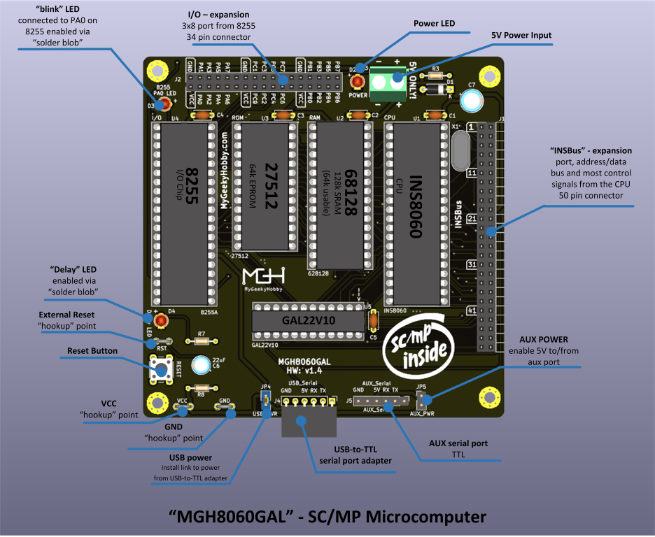

# MGH8060
SC/MP INS8060-based microcomputer running National Industrial Basic Language (NIBL)

This project is very similar to my other IN8060-based project [->"MGH8060"<-](https://github.com/Kris-Sekula/MGH8060) but uses a programmable logic device (GAL22V10) instead of discrete logic for address decoding.

Here is an overview of the device:

### Schematic
[Schematic - Version 1.2](Hardware/mgh8060gal_v1.4.pdf)

### Credits

* Early versions of my design were reviewed by Phil(aka [Retro Phil](https://www.mccrash-racing.co.uk/philg/picl/picl.htm)) who offered a lot of helpful suggestions, he also contributed all the firmware for MGH8060 and MGH8060GAL

## Release Notes

I used Winbond W27C512 (EEPROM pin compatible with standard EPROMs)

Please consider getting the PCB from my sponsor PCBWay

If you found this helpful and you like the work I do, why not buy me a coffee, thanks! :)

### Changes
* Version 1.4
  
  * Corrected missing ENIN to ground connection.
    
* Version 1.3
  
  * Initial version

## License

Copyright 2024 Kris Sekula

This work is licensed under a [Creative Commons Attribution-NonCommercial 4.0 International (CC BY-NC 4.0) ](https://creativecommons.org/licenses/by-nc/4.0/).

### Trademarks

* Other names and brands may be claimed as the property of others.
